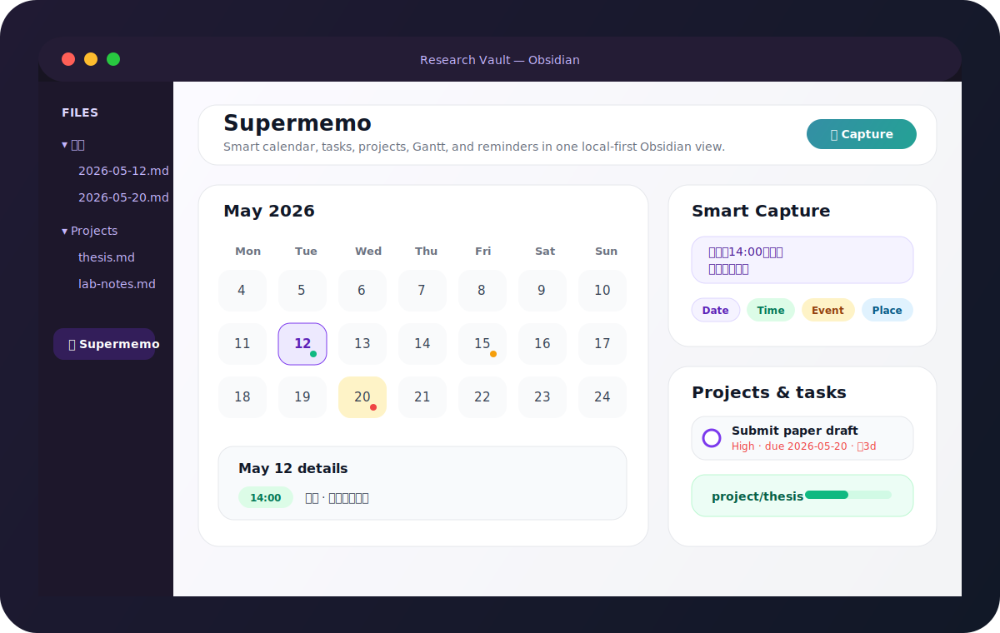
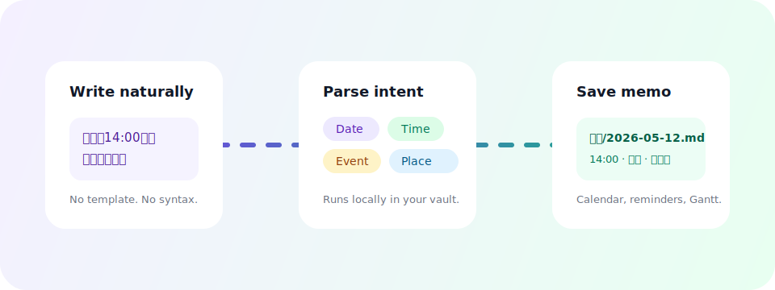
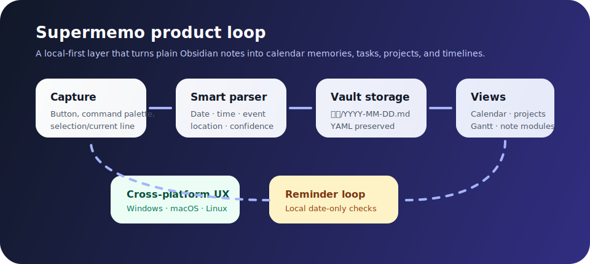

<div align="center">

# Supermemo

<p>
  <strong>A Fantastical-style smart memo plugin for Obsidian — natural-language capture, tasks, projects, Gantt charts, and cross-platform reminders in one unified timeline.</strong>
</p>

<p>
  <a href="LICENSE"></a>
  
  
  
  
</p>

<p>
  <a href="#quick-start">Quick Start</a> |
  <a href="#what-it-does">What It Does</a> |
  <a href="#demos">Demos</a> |
  <a href="#project-integration">Project Integration</a> |
  <a href="#reminders">Reminders</a> |
  <a href="#architecture">Architecture</a>
</p>

</div>

---

`supermemo` is an Obsidian plugin that turns everyday notes into a low-friction memory and task hub. It can capture natural language such as `下周二14:00打球，丘德拔体育馆`, extract date/time/event/place, and save the memo into `日记/YYYY-MM-DD.md` while still supporting structured tasks, projects, Gantt charts, and deadline-aware system notifications.

Core principle: **write naturally, stay local**. The diary you already write becomes the source of truth. No separate database, no external service, no account required.

<p align="center">
  
</p>

---

## What It Does

| Area | What the plugin supports |
| :--- | :--- |
| **Smart Capture** | Type or select natural language like `下周二14:00打球，丘德拔体育馆`; Supermemo extracts date, time, event, and place. |
| **Calendar View** | Monthly grid with task-dot indicators, overdue markers, and day-detail panel. |
| **Task Management** | Inline task creation with priority (high/medium/low), deadline picker, reminder scheduling, time, location, and tags. |
| **Custom Checkboxes** | Apple-style checkboxes with instant ✓ toggle and strikethrough — no full refresh needed. |
| **Project Tracking** | Auto-group tasks by `project/xxx` tags. Progress bars, overdue counts, expandable task lists. |
| **Gantt Chart** | Horizontal-bar timeline in the Projects view, plus ` ```memo-gantt` code blocks for diary notes. |
| **Deadline & Reminders** | Per-task deadline with 1-day / 3-day / 1-week advance system notifications on supported desktop platforms. |
| **Tag-to-Project Linking** | Any note with `tags: project/xxx` in frontmatter auto-links all its tasks to that project. |
| **Full-Vault Scanning** | Scans every markdown file in the vault for project tags — not limited to diary folder. |

---

## Quick Start

### One-liner install

```bash
bash -c 'for d in ~/Documents/*/.obsidian/plugins; do git clone https://github.com/zeyuShawn/supermemo.git "$d/supermemo" && exit; done'
```

This auto-discovers your Obsidian vault under `~/Documents` and clones the plugin into it.

Or manually:

```bash
cd /path/to/your-vault/.obsidian/plugins
git clone https://github.com/zeyuShawn/supermemo.git
```

Then:

1. Restart Obsidian or reload plugins (Cmd+Shift+P → `Reload`)
2. Enable **Supermemo** in Settings → Community Plugins
3. Click the calendar ribbon icon or run `Open Supermemo` from the command palette
4. The plugin auto-creates a `日记/` folder if it doesn't exist
5. Click `✨ Capture` and type a natural sentence, or run `Smart Capture Memo` from the command palette
6. Select text in any note and run `Smart Capture Memo from selection or current line`
7. Add `tags: [project/myproject]` to a diary note's frontmatter to create a project

No configuration needed.

---


## Product Flow

<p align="center">
  
</p>

Supermemo is designed for researchers, office workers, and everyday note-takers who do not want to stop and choose a schema before writing. The product loop is intentionally short:

1. **Write what you mean** — e.g. `下周二14:00打球，丘德拔体育馆` or `next Friday 10am submit report @ office`.
2. **Preview the extracted fields** — date, time, event, place, confidence.
3. **Save once** — the memo lands in the correct diary file and immediately appears in calendar/project views.

Supported smart-capture patterns include:

| Pattern | Examples |
| :--- | :--- |
| Relative dates | `今天`, `明天`, `后天`, `today`, `tomorrow` |
| Weekdays | `周二`, `下周二`, `next Tuesday`, `Friday` |
| Explicit dates | `2026-06-01`, `2026年6月1日`, `6/1` |
| Times | `14:00`, `下午2点`, `晚上7点半`, `2pm` |
| Places | `@实验室`, `，丘德拔体育馆`, `at office`, `在A301` |

<p align="center">
  
</p>

## Demos

### Demo 1: Smart Capture without formatting

```text
Input: 下周二14:00打球，丘德拔体育馆

Parsed preview:
- Date: next Tuesday
- Time: 14:00
- Event: 打球
- Place: 丘德拔体育馆

→ Saved into the matching 日记/YYYY-MM-DD.md file
→ Appears instantly in the calendar with time and location chips
```

### Demo 2: Adding a task with deadline and reminder

```text
1. Click a day in the calendar grid
2. Click the + button in the Tasks section
3. Type "Submit paper draft"
4. Select priority: High
5. Set deadline: 2026-05-20
6. Set remind: 3 days before
7. Click Add

→ Task appears in the list with a ⏰ deadline badge and a 🔔3d reminder badge
→ 3 days before May 20, a system notification fires when supported: "Task Reminder — 'Submit paper draft' is due in 3 days (2026-05-20)"
```

### Demo 3: Creating a project from a diary note

```yaml
---
tags:
  - project/thesis
tasks:
  - id: "abc123"
    text: "Send draft to advisor"
    done: false
    priority: high
    tags: [project/thesis]
    deadline: "2026-05-15"
    reminder: 1day
  - id: "def456"
    text: "Collect references"
    done: true
    priority: medium
    tags: [project/thesis]
---
# Thesis Progress

Today I finished the introduction and sent the draft.
```

→ Switch to Projects view: see "thesis" card with 50% progress bar
→ Expand the card: see each task with date, status, and deadline
→ Scroll down: Gantt chart shows project timeline from first task to deadline

### Demo 4: Gantt chart in a diary note

````markdown
## Project Timeline

```memo-gantt
project: thesis
```
````

→ The code block renders an interactive Gantt chart inside the reading view
→ Filter by project name, or omit the `project:` line to show all projects

---

## Project Integration

Three ways a note becomes part of a project:

| Method | Example |
| :--- | :--- |
| **Frontmatter tags** | `tags: [project/thesis]` — the note itself is tagged |
| **Task tags** | `tags: [project/thesis]` on individual tasks |
| **Body inline tags** | `#project/thesis` anywhere in the note body |

Tasks with their own `project/...` tag are associated with that specific project. Untagged tasks inside a project-tagged note inherit the note-level project, so project notes remain easy without incorrectly copying explicitly tagged tasks across projects.

Supported YAML tag formats:
- `tags: project/foo`
- `tags: [project/foo, project/bar]`
- `tags:\n  - project/foo\n  - project/bar`
- `tag: project/foo`

---

## Reminders

| Setting | Behavior |
| :--- | :--- |
| **1 day before** | Notification fires 1 day before the deadline |
| **3 days before** | Notification fires 3 days before the deadline |
| **1 week before** | Notification fires 7 days before the deadline |

- Check interval: every 5 minutes
- Deduplication: each reminder fires once per Obsidian session
- Permission: plugin requests browser/Electron notification permission on load when the API is available
- Graceful fallback: if notifications are blocked or unavailable on a platform, reminders silently skip

---

## Architecture

```
supermemo/
├── main.ts (Plugin entry)
│   ├── Registers CalendarView (ItemView)
│   ├── Registers memo-gantt code block processor
│   ├── Registers Smart Capture commands
│   └── Starts 5-minute reminder check loop
├── CalendarView.ts
│   ├── Calendar grid (monthly) + day detail panel
│   ├── Projects view with progress bars + task expansion
│   ├── Gantt chart integration
│   └── Inline task/project creation forms
├── SmartMemoParser.ts
│   └── Local natural-language parser for date/time/event/place
├── SmartCaptureModal.ts
│   └── Zero-format capture modal with parsed preview
├── taskManager.ts
│   ├── CRUD operations on diary YAML frontmatter
│   └── Body append for work-log entries
├── projectManager.ts
│   ├── Full-vault project tag scanning
│   └── Project creation with auto-inserted Gantt block
├── GanttChart.ts
│   ├── Horizontal bar rendering with today marker
│   └── Code block parameter parser
├── reminder.ts
│   ├── Deadline-aware reminder checker
│   └── Desktop Notification API integration with graceful fallback
├── parser.ts
│   └── YAML frontmatter parse/serialize with task fields
├── scanner.ts
│   └── Diary file discovery and grouping
└── types.ts
    └── Shared TypeScript types (Task, Project, CalendarState, ReminderOffset)
```

---

## Repository Layout

<details open>
<summary><strong>View Repository Tree</strong></summary>

```text
supermemo/
├── README.md
├── LICENSE
├── manifest.json
├── package.json
├── tsconfig.json
├── esbuild.config.mjs
├── styles.css
├── main.js                  (compiled plugin output)
├── docs/
│   └── assets/              (README diagrams)
└── src/
    ├── main.ts              (plugin entry point)
    ├── CalendarView.ts      (main UI — calendar, day detail, projects)
    ├── SmartMemoParser.ts   (natural-language memo parser)
    ├── SmartCaptureModal.ts (smart capture UI)
    ├── taskManager.ts       (task CRUD on diary files)
    ├── projectManager.ts    (project detection and creation)
    ├── GanttChart.ts        (Gantt chart renderer)
    ├── reminder.ts          (reminder scheduler + notifications)
    ├── parser.ts            (YAML frontmatter parser)
    ├── scanner.ts           (diary file scanner)
    └── types.ts             (TypeScript types and constants)
```

</details>

---

## Local Data and Privacy

- All data lives in your Obsidian vault's `日记/` folder as plain Markdown files
- No external API calls, no telemetry, no cloud sync
- Task and project state is stored in YAML frontmatter — fully human-readable and git-friendly
- Reminder notifications use the local desktop Notification API when available and gracefully skip when blocked or unsupported

---

## Development

```bash
# Install dependencies
npm install

# Dev build (watch mode)
npm run dev

# Production build
npm run build
```

---

## License

MIT License. See [LICENSE](LICENSE).

---

## Suggested GitHub Topics

<details>
<summary><strong>View Suggested Topics</strong></summary>

```text
obsidian
obsidian-plugin
calendar
task-management
project-management
gantt-chart
productivity
macos-notifications
local-first
privacy
typescript
diary
yaml
reminders
fantastical
```

</details>
